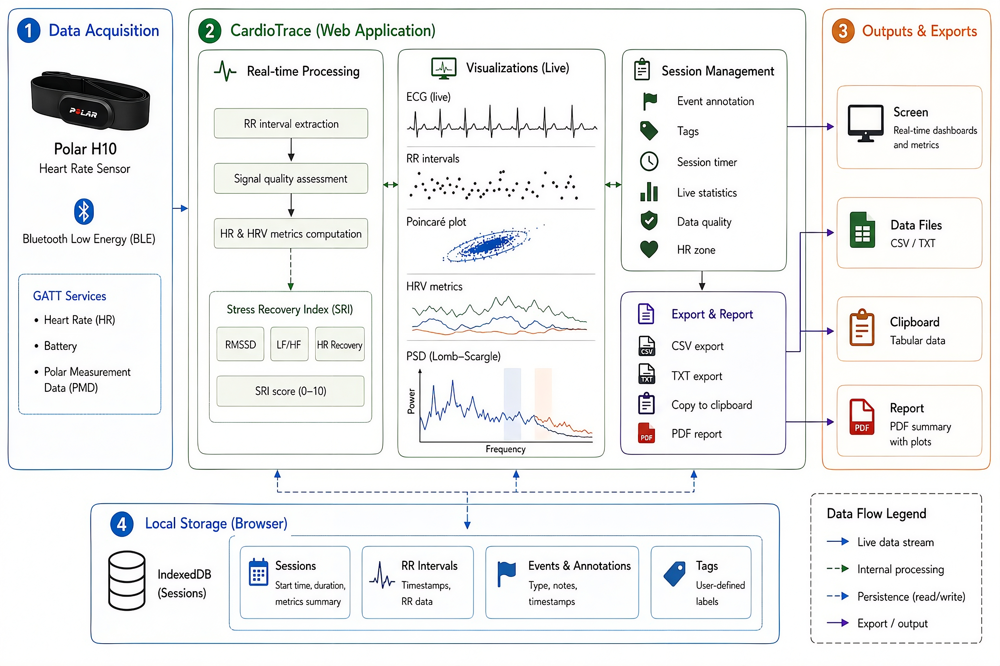
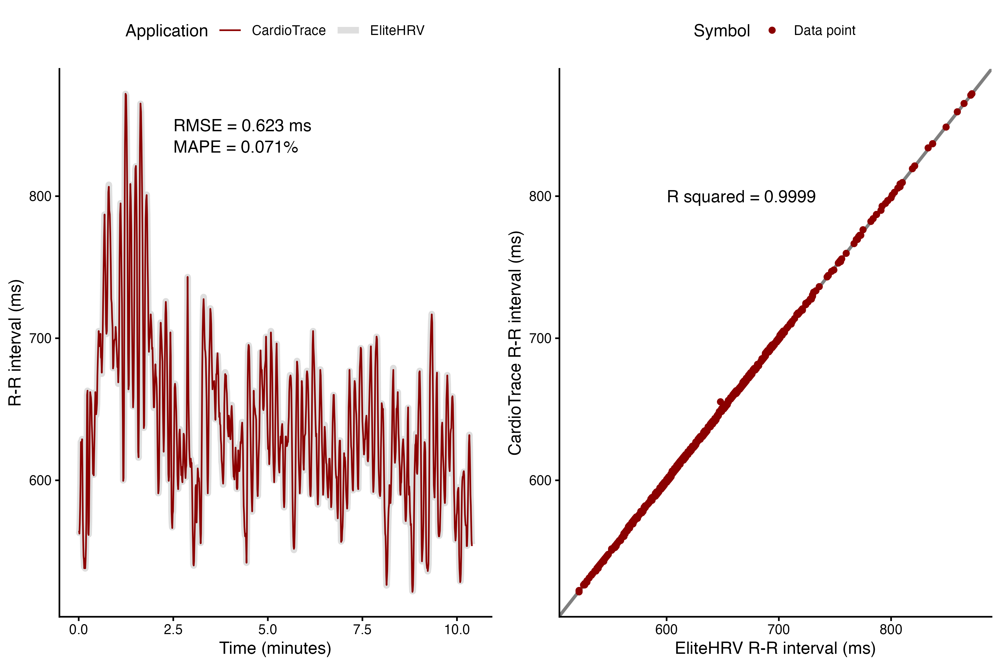

:::{custom-style="MDPI_1.1_article_type"}
Article
:::

:::{custom-style="MDPI_1.2_title"}
CardioTrace: an open-source browser-based platform for real-time RR interval acquisition and event annotation in public health and environmental heart rate variability research
:::

:::{custom-style="MDPI_1.3_authornames"}
Matías Castillo-Aguilar^1,2^, Diego Mabe-Castro^1^, Ginés Viscor^3^, Cristian Núñez-Espinosa^1,2^\*
:::

::: {custom-style="MDPI_1.6_affiliation"}
^1^ Centro Asistencial Docente y de Investigación (CADI-UMAG), Punta Arenas, Chile.

^2^ Escuela de Medicina, Universidad de Magallanes (UMAG), Punta Arenas, Chile

^3^ Physiology Section, Department of Cell Biology, Physiology and
Immunology, Faculty of Biology, Universitat de Barcelona, Barcelona, Spain.

**\*** Correspondence: [cristian.nunez\@umag.cl](mailto:cristian.nunez@umag.cl). Address: Avenida Bulnes 01855, Box 113-D. Phone: +56 61 2201411.
:::

::: {custom-style="MDPI_1.7_abstract"}
**Abstract**

Wearable sensors provide accessible, high-resolution RR-interval data for heart rate variability research. Still, research-grade acquisition remains limited by proprietary applications, restricted access to raw data, insufficient event annotation, and weak integration with reproducible analysis workflows. We present CardioTrace, an open-source, browser-based application for real-time acquisition, visualization, event annotation, and export of wearable-derived RR intervals, with specific compatibility with the Polar H10 chest strap via Bluetooth Low Energy. CardioTrace enables researchers to record RR intervals in real time, annotate experimental phases such as rest, exercise, recovery, or custom events, monitor signal behaviour during acquisition, and export time-stamped datasets in formats compatible with downstream HRV analysis tools. The application runs entirely client-side in a standard web browser, requires no local installation, stores sessions locally through IndexedDB, and automatically saves data during recording to reduce the risk of data loss. By integrating real-time physiological monitoring, structured event marking, transparent data export, and open-source implementation, CardioTrace addresses a practical methodological gap between consumer wearable data streams and research-oriented autonomic workflows. By lowering technical barriers and ensuring local data privacy, this software supports reproducible experimental protocols in public health interventions, environmental stress monitoring, occupational health, and field-based epidemiological studies.
:::

::: {custom-style="MDPI_1.8_keywords"}
**Keywords**: heart rate variability; digital epidemiology; wearable devices; public health monitoring; occupational health; real-time acquisition; event annotation; open-source software.
:::



::: {custom-style="MDPI_2.1_heading1"}
Introduction
:::

::: {custom-style="MDPI_3.1_text"}
Wearable devices capable of streaming high-resolution RR intervals (RRi) are increasingly used in public health monitoring, environmental stress assessments, occupational health, and human performance studies [@castillo2025enhancing; @castillo2025immune; @castillo2026immune]. However, the scientific integration of wearable-derived data is often constrained by limitations at the data-acquisition stage rather than by signal analysis. Many commercial applications focus on proprietary metrics and post-hoc summaries, offering limited access to raw data, restricted transparency, and insufficient support for precise experimental event annotation. This creates a methodological bottleneck at the acquisition stage: even when robust HRV analysis pipelines are available, the scientific quality of the resulting analysis depends on whether RR intervals were captured, annotated, synchronized, and exported in a transparent and reproducible manner.

A recurring methodological challenge in epidemiological studies, occupational health assessments, and behavioral interventions is accurately aligning physiological signals with specific environmental exposures or experimental events in time. In many workflows, event timing is recorded manually or reconstructed retrospectively, introducing uncertainty. While analysis-oriented tools such as Kubios HRV [@tarvainen2014kubios] and open-source libraries including NeuroKit2 [@makowski2021neurokit2] and PhysioZoo [@behar2018physiozoo] provide robust post-processing capabilities, they depend on externally acquired and pre-segmented data. Conversely, real-time monitoring platforms such as Elite HRV or Firstbeat operate as closed systems with limited control over annotation and export, leaving a gap between real-time data streams and research-grade acquisition workflows.

Therefore, the novelty of CardioTrace does not lie in replacing established HRV analysis platforms, but in standardizing the acquisition layer that precedes them. By combining real-time RR interval streaming, protocol-specific event annotation, automatic local persistence, and transparent export formats, CardioTrace strengthens the methodological chain between wearable sensors and downstream autonomic analysis.

The software presented here addresses this gap by providing an open, web-based interface for real-time RRi acquisition combined with structured, time-stamped event annotation. The application runs directly in a standard web browser and does not require local installation, lowering technical barriers and facilitating deployment across diverse community and environmental settings. Furthermore, its client-side architecture inherently protects sensitive participant health data, facilitating compliance with Institutional Review Board (IRB) privacy requirements for epidemiological and public health research. To improve robustness, acquired data are automatically saved at fixed intervals during active sessions, reducing the risk of data loss from common technical interruptions, such as Bluetooth disconnections or device shutdowns. 

In the intended experimental setting, a researcher connects a compatible wearable device via a web browser, initiates data acquisition, annotates predefined or custom events in real time, and monitors signal quality throughout the session. Upon completion, the full dataset, including RRi and event markers, or RRi data only can be exported in both txt and csv formats for downstream analysis. By emphasizing accessibility, transparency, and fault-tolerant data handling, this software supports more rigorous and reproducible wearable-based research workflows and complements existing analysis-focused tools.
:::

::: {custom-style="MDPI_2.1_heading1"}
Material and Methods
:::

::: {custom-style="MDPI_2.2_heading2"}
Software architecture
:::

::: {custom-style="MDPI_3.1_text"}
CardioTrace follows a single-tier, client-side architecture that executes entirely within a standards-compliant web browser, with no server-side components or local installation requirements. This decentralized design ensures that all sensitive physiological data remain strictly on the researcher's local machine, addressing critical data privacy concerns common in large-scale public health monitoring. Because Web Bluetooth support varies across browsers and operating systems, CardioTrace must be deployed in compatible environments. The recommended configuration is Google Chrome or another Chromium-based browser on desktop or Android systems, where Bluetooth Low Energy (BLE) communication with compatible wearable devices is currently more consistently supported. Native iOS browsers (e.g., Safari) are currently not supported, given that they do not allow in-browser BLE connections with third-party applications. The application is organized into three functional layers (Figure 1).
:::

{width=100% custom-style="MDPI_5.2_figure"}

::: {custom-style="MDPI_5.1_figure_caption"}
**Figure 1**. Functional layers related to the foundational architecture of the CardioTrace application. The application is divided in three layers: a connectivity layer for data acquisition (left panel), a processing layer where statistics and data quality metrics are computed (middle panel), a presentation layer with plots/animations (right panel), and a persistence layer for in-browser data management (bottom panel).
:::

::: {custom-style="MDPI_3.1_text"}
The connectivity layer interfaces with Bluetooth Low Energy (BLE) wearable devices through the Web Bluetooth API, a browser-native interface that enables direct communication with GATT-based peripherals. Upon connection, the application subscribes to two BLE services: the standard Heart Rate GATT service (UUID 0x180D), which streams HR measurements and RR intervals via the Heart Rate Measurement characteristic (0x2A37), and the Polar Measurement Data (PMD) proprietary service (UUID fb005c80), which enables raw ECG streaming on compatible devices (e.g., Polar H10). An initial calibration window of 8 seconds is applied upon connection; data acquired during this period are discarded to ensure baseline signal stability before recording commences. Currently, the app exclusively supports Polar H10 chest bands. In the future, the application will extend to support more devices.

The processing layer handles all signal operations in real time using plain JavaScript. Artifact rejection is applied to each incoming RR interval by enforcing physiological validity bounds (250–2000 ms, corresponding to heart rates of 30–200 BPM) and a maximum permissible inter-beat difference of 300 ms. Both the unfiltered (raw) and artifact-rejected (clean) streams are stored in parallel, preserving data provenance. Frequency-domain analysis uses a Lomb–Scargle periodogram [@laguna1998power], which accommodates the non-uniform sampling of RR series without prior interpolation, followed by spectral smoothing with a five-point moving-average filter. The Stress Recovery Index (SRI) is implemented as an exploratory composite display intended to summarize short-term changes in autonomic-related metrics during acquisition. It combines RMSSD, LF/HF ratio, and heart rate recovery rate using predefined weights. Because this index has not yet been independently validated as a clinical or diagnostic marker, it should be interpreted as a visualization aid rather than as a standalone physiological outcome [@camm1996heart].

The persistence and presentation layers manage data storage and visualization. Session data, including RR intervals, event markers, tags, and computed statistics, are persisted to the browser's IndexedDB (schema version 4) through an auto-save routine triggered every 10 seconds during active recording. Visualization is handled by Plotly.js (v2.27.0), which renders five real-time charts: ECG waveform, RR interval series, 1-minute rolling RMSSD, Poincaré plot, and Power Spectral Density. Export utilities rely on jsPDF (v2.5.1) for PDF report generation and JSZip (v3.10.1) for bulk session download as a compressed archive.
:::

::: {custom-style="MDPI_2.2_heading2"}
Software functionalities
:::

::: {custom-style="MDPI_3.1_text"}
CardioTrace exposes the following major functionalities, grouped by workflow stage.

Device connection and calibration. The user initiates a BLE scan through the browser's device picker, which filters for devices advertising the Heart Rate GATT service. Upon pairing, the application enters an 8-second calibration period before data recording begins, ensuring that transient artifacts introduced at connection do not contaminate the session record. Battery level and signal quality are monitored continuously throughout the session.

Real-time data acquisition and artifact filtering. RR intervals are extracted from each incoming HR Measurement notification. Critically, R-wave detection is performed entirely onboard the wearable device by its proprietary firmware; for the Polar H10, this algorithm has been independently validated against electrocardiographic reference standards across a range of physical activity intensities [@gilgen2019rr; @schaffarczyk2022validity; @chung2026validity], rendering additional R-peak detection at the software level unnecessary. The intervals received by the application therefore, represent already-identified inter-beat intervals rather than raw ECG samples. The artifact rejection implemented in CardioTrace constitutes a supplementary quality-control layer, addressing residual transmission errors, isolated ectopic beats, or motion-induced outliers, and operates through two sequential criteria: a physiological bounds check (250–2000 ms, corresponding to 30–200 BPM) followed by an inter-beat difference gate (≤300 ms). Intervals passing both criteria are appended to the cleaned stream; all intervals received after calibration, regardless of validity, are preserved in a parallel raw stream. For compatible devices, raw ECG data are simultaneously streamed via the Polar PMD service.

Event annotation. At any point during a session, the researcher may insert a time-stamped event marker by activating the Mark Event panel. Eight predefined event types are available (Start, Exercise, Rest, Peak, Recovery, Breathe, Note, and Custom), each optionally accompanied by a free-text annotation. Event time-stamps are stored relative to the post-calibration recording onset and are embedded in all export formats.

Session tagging and automatic persistence. Researchers may attach one or more descriptive tags to a session (e.g., a participant identifier or an experimental condition) before or during recording. Session data, including both RR streams, event markers, computed statistics, and tags, is automatically saved to the browser's IndexedDB every 10 seconds, providing fault tolerance against Bluetooth disconnections or browser interruptions.

Real-time metrics and visualization. Five interactive charts update continuously: (i) ECG signal trace; (ii) RR interval time series with event marker overlays; (iii) rolling RMSSD; (iv) Poincaré plot; and (v) Lomb–Scargle Power Spectral Density [@laguna1998power] with annotated VLF, LF, and HF bands and LF/HF ratio. LF/HF values are displayed as descriptive spectral indicators. They should not be interpreted as direct measures of sympathovagal balance, particularly during non-stationary periods such as exercise onset or recovery [@camm1996heart]. A five-zone heart rate classification scheme is also displayed in real time. The SRI gauge provides an exploratory composite display of short-term autonomic-related changes.

Data export. Upon session completion, data may be exported as: (i) a CSV file containing time-stamped RR intervals and event markers with a structured metadata header; (ii) a plain TXT file containing RR interval values only, suitable for direct import into analysis tools; or (iii) a formatted report summarising session statistics and chart snapshots. Multiple sessions stored in history can be downloaded simultaneously as a ZIP archive.

Session history management. All sessions saved to IndexedDB are accessible through the history panel, which supports full-text search, tag-based filtering, and sorting by date or duration. Sessions can be individually restored to the active interface, re-exported in any supported format, or permanently deleted.
:::

::: {custom-style="MDPI_4.1_table_caption"}
**Table 1**. Main CardioTrace functionalities and scientific relevance.
:::

| Function                 | Description                                                              | Scientific relevance                                                 |
|--------------------------|--------------------------------------------------------------------------|----------------------------------------------------------------------|
| Real-time RR acquisition | Streams RR intervals from compatible BLE wearables                       | Enables continuous monitoring during experimental protocols          |
| Event annotation | Marks rest, physical exertion, recovery, specific exposures, notes, or custom events | Supports phase- and exposure-specific HRV segmentation |
| Raw and filtered streams | Stores original and artifact-filtered RR intervals                       | Preserves data provenance and quality control                        |
| Local persistence        | Auto-saves sessions every 10 seconds in IndexedDB                        | Reduces data loss during field or laboratory recordings              |
| Visualization            | Displays RR series, RMSSD, Poincaré plot, PSD, ECG trace                 | Supports real-time inspection of signal behavior                     |
| Export                   | CSV, TXT, ZIP formats                                               | Facilitates downstream analysis in Kubios, NeuroKit2, or other tools |
| Open-source architecture | HTML, CSS, JavaScript; MIT license                                       | Supports transparency, auditability, and reproducibility             |

::: {custom-style="MDPI_2.1_heading1"}
Results
:::

::: {custom-style="MDPI_2.2_heading2"}
Illustrative examples
:::

::: {custom-style="MDPI_3.1_text"}
The following example illustrates a complete data-acquisition workflow for an acute physical stress and recovery protocol, a typical use case in occupational health and environmental stress research. Scenario: A researcher aims to characterize the acute autonomic response to an occupational exertion task (e.g., loaded cycling for active commuting or manual labor) and subsequent passive recovery, using a Polar H10 chest-strap worn by a healthy participant.

Step 1: Device connection. The researcher navigates to the CardioTrace application in a Web Bluetooth-compatible browser (e.g., Google Chrome ≥56 on desktop or Android), attaches the Polar H10 to the participant, and clicks Connect Device. The browser device picker displays available BLE peripherals; the researcher selects the Polar H10. The application negotiates both the HR GATT and Polar PMD services, initiates an 8-second calibration period, and then begins recording. Battery level, signal quality, and HR zone are displayed in the connection panel.

Step 2: Baseline recording and event marking. The participant remains seated at rest for five minutes. The researcher observes rising RMSSD values and an SRI score in the Good–Excellent range. At the onset of the rest phase, the researcher opens the Mark Event panel and inserts a Start event with the annotation “baseline rest”. Event markers are visible as vertical lines on the RR interval and rolling RMSSD charts.

Step 3: Exertion phase. The participant begins the physical exertion task, reaching 70% of their estimated maximum heart rate. The researcher marks an Exercise (or custom 'Exertion') event at the transition.

Step 4: Recovery phase. At the cessation of exercise, the researcher marks a Recovery event. Over the following minutes, progressive restoration of RR interval variability is evident across all panels. A Rest event is marked once the SRI returns to pre-exercise levels.

Step 5: Session export. The researcher enters a session label in the filename field, adds tags (e.g., participant-01, occupational-exertion), and clicks Download. With the CSV format selected and the Include raw data toggle disabled, a file is generated containing the artifact-filtered RR series with embedded event markers, along with a structured metadata header recording the session date, duration, data quality, and event count. The same data may also be exported as a TXT file for direct import into downstream analysis tools such as Kubios HRV [@tarvainen2014kubios] or the NeuroKit2 Python library [@makowski2021neurokit2]. A PDF report summarising session statistics and chart snapshots is generated via the Report button.

The session is automatically preserved in the history panel under the assigned tags and is retrievable for re-export or review in future browser sessions.
:::

::: {custom-style="MDPI_2.2_heading2"}
Technical verification and data integrity
:::

::: {custom-style="MDPI_3.1_text"}
CardioTrace was designed to preserve data integrity during real-time wearable-based acquisition. Because RR intervals are detected by the wearable firmware and transmitted to the application through Bluetooth Low Energy, CardioTrace should be interpreted as an acquisition, annotation, visualization, and export layer rather than an independent R-peak detection algorithm. Accordingly, as an illustrative example, we present data simultaneously acquired from two Polar H10 chest straps placed on the same subject, with one device paired to EliteHRV and the other to CardioTrace. A comparison of both signals, shown in Figure 2, indicates that the exported RRi from the two applications are identical, with an R^2^ value close to 1, a root mean squared error (RMSE) below 1 ms, and a mean absolute percentage error (MAPE) below 0.1%. This example provides evidence that data integrity is not determined by the application used for acquisition, but rather by the device-specific wearable firmware algorithms responsible for RRi detection.
:::

{width=100% custom-style="MDPI_5.2_figure"}

::: {custom-style="MDPI_5.1_figure_caption"}
**Figure 2**. Comparison of data acquired by EliteHRV and CardioTrace using two Polar H10 chest straps placed on the same subject simultaneously, illustrating data integrity relative to an industry-standard application for RRi acquisition. The performance metrics indicate near-perfect agreement between the EliteHRV and CardioTrace applications, suggesting no differences in data integrity at the software level. RMSE, root mean squared error; MAPE, mean absolute percentage error.
:::

::: {custom-style="MDPI_2.1_heading1"}
Discussion
:::

::: {custom-style="MDPI_3.1_text"}
CardioTrace may enable new lines of inquiry in wearable-based autonomic research by facilitating experimental designs that require precise, real-time alignment between physiological signals and experimental events. This is particularly relevant for public health interventions, occupational health monitoring, environmental exposure studies (e.g., extreme heat or urban noise stress), aging research, and remote field-based epidemiology, where transitions between conditions or exposure to environmental stressors are critical and difficult to reconstruct retrospectively. By allowing structured event annotation during acquisition, the software supports phase-specific and event-driven analyses of transient autonomic responses, rapid recovery dynamics, and protocol-dependent HRV segmentation using wearable-derived RR intervals.

Compared with workflows based on external logging, retrospective synchronization, or proprietary applications, CardioTrace integrates acquisition, annotation, visualization, local persistence, and export within a single browser-based environment. This approach improves methodological rigor by reducing uncertainty associated with post-hoc event reconstruction, while automatic session saving mitigates data loss caused by Bluetooth disconnections, browser interruptions, or device-related technical failures. Its installation-free design also lowers technical barriers, enabling rapid deployment by multidisciplinary teams across laboratory and field settings.

The open-source release of CardioTrace under a permissive license further strengthens transparency and reproducibility. Because the application is implemented in standard web technologies without compiled binaries, proprietary runtime dependencies, or external data transmission, researchers can inspect, adapt, and extend the complete acquisition workflow, from BLE communication and calibration logic to artifact-rejection thresholds and export formatting. In this sense, CardioTrace provides a transparent, privacy-preserving acquisition and annotation layer that complements downstream HRV analysis platforms and may be adapted for applied contexts such as community-based health monitoring, occupational safety, epidemiological screening, or digital health prototyping.

Several limitations should be acknowledged. First, CardioTrace depends on the availability and stability of the Web Bluetooth API, which is not uniformly supported across all browsers and operating systems. Second, although the Polar H10 provides validated RR-interval detection, CardioTrace does not independently detect R peaks from raw ECG for its primary RR-interval stream. Therefore, the quality of RR intervals depends on the wearable firmware and the Bluetooth transmission process. Third, the implemented artifact rejection rules are intentionally simple and transparent, but they may not replace more advanced correction procedures available in specialized HRV software. Fourth, frequency-domain estimates obtained during real-time acquisition should be interpreted cautiously, especially during short or non-stationary segments such as acute physical transitions or early recovery. Additionally, while the offline capabilities are robust, deployment in extreme remote environments requires initial internet access to cache the web application before offline field use. Fifth, the application is currently limited to connect to Polar H10 chest straps, limiting its use with other third-party devices. Nonetheless, in future versions, the application will be compatible with a more diverse set of recording devices compatible with BLE technologies. Finally, the SRI display should be considered exploratory until it is formally validated against established autonomic, recovery, or clinical outcomes. 
:::

::: {custom-style="MDPI_2.1_heading1"}
Conclusion
:::

::: {custom-style="MDPI_3.1_text"}
CardioTrace provides an open-source, browser-based solution for real-time RR interval acquisition, visualization, event annotation, local persistence, and export using wearable sensors such as the Polar H10. The application addresses a practical methodological gap in HRV research by improving the temporal alignment between physiological signals and experimental events while maintaining transparency of the acquisition workflow. Rather than replacing specialized HRV analysis software, CardioTrace complements existing platforms by standardizing the acquisition and annotation stage that precedes downstream analysis. Its client-side architecture, lack of installation requirements, automatic local storage, and open-source implementation make it suitable for laboratory, field-based, and intervention studies that require flexible, reproducible RR interval capture. Future work should evaluate event-timing accuracy, cross-platform stability, compatibility with additional BLE devices, and agreement of exported RR interval datasets with established HRV analysis pipelines.
:::

::: {custom-style="MDPI_6.2_back_matter"}
**Author Contributions**: Conceptualization: M.C.-A.; Investigation, M.C.-A.;Methodology, M.C.-A.; Supervision, C.N.-E.; Visualization, M.C.-A.; Writing–original draft, M.C.-A., D.M.-C. and C.N.-E.; Writing–review & editing, M.C.-A., D.M.-C., G.V. and C.N.-E. All authors have read and agreed to the published version of the manuscript.

**Funding**: CN-E was funded by ANID Proyecto FONDECYT Regular Nº1250474 and by the Innovation Fund for Competitiveness of the Regional Government of Magallanes and Chilean Antarctica (BIP Code 40042452-0).

**Institutional Review Board Statement**: No participant-level data is included in this software manuscript.

**Data availability statement**: The source code of CardioTrace is publicly available at https://github.com/matcasti/cardiotrace under the MIT License. A live version of the application is available at https://matcasti.github.io/CardioTrace/. No participant-level data are included in this software manuscript.

**Conflicts of interests**: The authors declare that the research was conducted without any commercial or financial relationships construed as a potential conflict of interest.
:::

::: {custom-style="MDPI_2.1_heading1"}
References
:::

:::{custom-style="MDPI_6.3_notes"}
**Disclaimer/Publisher's Note**: The statements, opinions and data contained in all publications are solely those of the individual author(s) and contributor(s) and not of MDPI and/or the editor(s). MDPI and/or the editor(s) disclaim responsibility for any injury to people or property resulting from any ideas, methods, instructions or products referred to in the content.
:::
